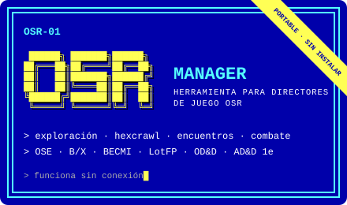
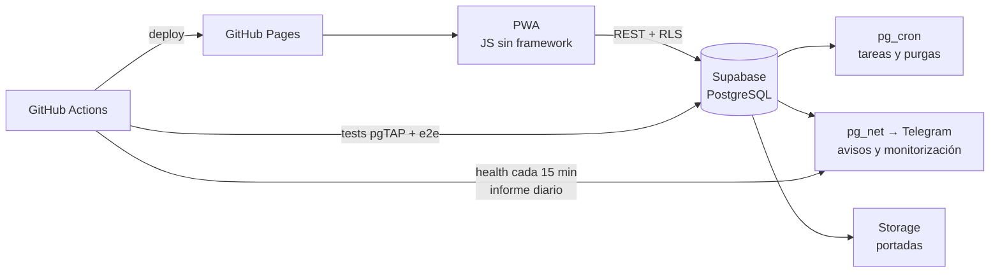

<div align="center">

```text
 ███████╗ █████╗ ██╗   ██╗ █████╗ ███████╗██╗  ██╗██╗
 ██╔════╝██╔══██╗██║   ██║██╔══██╗██╔════╝██║  ██║██║
 █████╗  ███████║██║   ██║███████║███████╗███████║██║
 ██╔══╝  ██╔══██║╚██╗ ██╔╝██╔══██║╚════██║██╔══██║██║
 ██║     ██║  ██║ ╚████╔╝ ██║  ██║███████║██║  ██║██║
 ╚═╝     ╚═╝  ╚═╝  ╚═══╝  ╚═╝  ╚═╝╚══════╝╚═╝  ╚═╝╚═╝
```

**Toni Ruiz** · DevOps & Developer · Director de juego OSR

*Automatizo infraestructura de día y catalogo mazmorras de noche. Barcelona.*

[](http://toniruiz.es)
[](https://favashi.github.io/escribadelamarca/?ref=github-perfil)
[](https://favashi.github.io/osr-manager/?ref=github-perfil)

</div>

---

### `$ kubectl get adventurer favashi -o yaml`

```yaml
apiVersion: marca.del.este/v1
kind: Adventurer
metadata:
  name: favashi
  labels:
    clase: devops-and-developer
    # si se hace dos veces, es un pipeline
    alineamiento: legal-automatizado
    campaña: la-marca-del-este
spec:
  # nivel de nombre en B/X: con fortaleza
  nivel: 9
  atributos:
    FUE: 11  # levanta clústeres, no pesas
    DES: 14  # atajos de teclado
    CON: 17  # guardias de madrugada
    INT: 16
    SAB: 15  # no despliega en viernes
    CAR: 13
  habilidades:
    cloud: [aws, gcp, azure]
    contenedores:
      [docker, kubernetes, compose, nginx]
    ci-cd: [jenkins, github-actions]
    iac: [terraform, ansible]
    observabilidad:
      [prometheus, grafana, elk]
    backend:
      [php, python, go, dotnet, nodejs]
    apis: [rest, graphql, microservicios]
    arquitectura: [hexagonal, ddd]
    datos:
      [postgresql, mysql, sql-server, nosql]
    frontend:
      [javascript, react, angularjs, pwa]
    ia: [agentes, rag, llm, n8n, make]
    calidad: [phpunit, pgtap, playwright]
  idiomas: [español, catalán, inglés]
  equipo:
    - makefile        # make help, y a jugar
    - docker-compose  # el entorno: make up
    - github-actions  # +2 a automatizar
    - supabase        # postgres, RLS y cron
    - pgtap           # salvación contra
    - playwright      #   regresiones
    - d20             # varios, por si acaso
  reliquias:
    # en Svalbard, para 1000 años
    - arctic-code-vault
  conjuros_preparados:
    - reversión-en-caliente   # nivel 3
    - detectar-pantallas-en-blanco
status:
  hp: estable
  uptime: la mayoría de los días
```

### Módulos publicados

<p align="center">
  <a href="https://github.com/Favashi/escribadelamarca"></a>
  <a href="https://github.com/Favashi/osr-manager"></a>
</p>

<p align="center">
  <a href="https://favashi.github.io/escribadelamarca/?ref=github-perfil"><b>Abrir Escriba</b></a> ·
  <a href="https://github.com/Favashi/escribadelamarca">código</a>
  &nbsp;&nbsp;|&nbsp;&nbsp;
  <a href="https://favashi.github.io/osr-manager/?ref=github-perfil"><b>Abrir OSR Manager</b></a> ·
  <a href="https://github.com/Favashi/osr-manager">código</a>
</p>

### Cómo está montado Escriba de la Marca



- **Coste de infraestructura: 0 €.** Planes gratuitos, sin servicios externos para la monitorización.
- **Calidad:** <!-- AUTO:tests -->208<!-- /AUTO:tests --> tests de base de datos (pgTAP) y de extremo a extremo (Playwright) en cada cambio.
- **Seguridad:** toda la lógica sensible con *Row Level Security* y funciones `security definer`; nada de claves en el cliente.

### En curso

<!-- AUTO:now -->
- **Escriba de la Marca [v1.14.0](https://github.com/Favashi/escribadelamarca/releases/tag/v1.14.0)** · Elige tu nombre público en el Perfil: es el que se ve en la Comunidad y en tu lista de deseos compartida.
- **OSR Manager [v0.4.0](https://github.com/Favashi/osr-manager/releases/tag/v0.4.0)**
<!-- /AUTO:now -->

### Tirada de estadísticas

<!-- Se actualiza sola cada día con .github/workflows/update-readme.yml (datos públicos, sin servicios de terceros). -->
<!-- AUTO:stats -->
| | |
|---|---|
| Publicaciones en el catálogo de Escriba | 118 |
| Autores de la Marca catalogados | 83 |
| Aventuras en el buscador | 83 |
| Libros registrados por los usuarios | 1.307 |
| Tests en CI de Escriba | 208 |
| Coste de infraestructura | 0 € |
<!-- /AUTO:stats -->

<sub>Actualizado automáticamente: <!-- AUTO:date -->2026-09-30<!-- /AUTO:date --></sub>

<div align="center">

<sub>*«Ningún plan sobrevive al contacto con los jugadores. Ningún despliegue, al contacto con producción.»*</sub>

</div>
