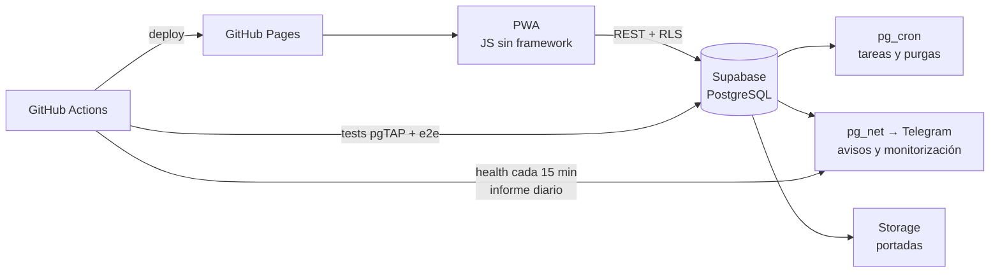

<div align="center">

```text
 ███████╗ █████╗ ██╗   ██╗ █████╗ ███████╗██╗  ██╗██╗
 ██╔════╝██╔══██╗██║   ██║██╔══██╗██╔════╝██║  ██║██║
 █████╗  ███████║██║   ██║███████║███████╗███████║██║
 ██╔══╝  ██╔══██║╚██╗ ██╔╝██╔══██║╚════██║██╔══██║██║
 ██║     ██║  ██║ ╚████╔╝ ██║  ██║███████║██║  ██║██║
 ╚═╝     ╚═╝  ╚═╝  ╚═══╝  ╚═╝  ╚═╝╚══════╝╚═╝  ╚═╝╚═╝
```

**Toni Ruiz** · DevOps & Developer · Director de juego OSR

*Automatizo infraestructura de día y catalogo mazmorras de noche. Barcelona.*

[](http://toniruiz.es)
[](https://favashi.github.io/escribadelamarca/?ref=github-perfil)
[](https://favashi.github.io/osr-manager/?ref=github-perfil)

</div>

---

### `$ kubectl describe adventurer favashi`

```yaml
apiVersion: marca.del.este/v1
kind: Adventurer
metadata:
  name: favashi
  labels:
    clase: devops-and-developer
    alineamiento: legal-automatizado      # si se hace dos veces, se hace un pipeline
    campaña: aventuras-en-la-marca-del-este
spec:
  nivel: 9                      # nivel de nombre en B/X: ya tiene fortaleza propia
  atributos:
    FUE: 11   # levanta clústeres, no pesas
    DES: 14   # atajos de teclado
    CON: 17   # guardias de madrugada
    INT: 16
    SAB: 15   # sabe cuándo NO desplegar un viernes
    CAR: 13
  habilidades:
    cloud: [aws, google-cloud, azure]
    contenedores: [docker, kubernetes, docker-compose, nginx]
    ci-cd: [jenkins, github-actions]
    infraestructura-como-código: [terraform, ansible]
    observabilidad: [prometheus, grafana, elk-stack]
    backend: [php, python, go, dotnet, nodejs, rest, graphql, microservicios]
    arquitectura: [hexagonal, ddd, inyección-de-dependencias]
    datos: [postgresql, mysql, sql-server, nosql]
    frontend: [javascript, react, angularjs, html5, sass, pwa]
    ia-y-automatización: [agentes, rag, llm, n8n, make, zapier]
    calidad: [phpunit, pgtap, playwright]
  idiomas: [español, catalán, inglés]
  equipo:
    - makefile               # un «make help» para gobernarlos a todos
    - docker-compose         # el entorno entero con un «make up»
    - github-actions         # +2 a la automatización
    - supabase               # postgres con RLS, cron y colas
    - pgtap + playwright     # tirada de salvación contra regresiones
    - dados de 20 caras      # varios, por si acaso
  reliquias:
    - arctic-code-vault      # código enterrado en Svalbard: sobrevivirá 1000 años
  conjuros_preparados:
    - «Reversión en caliente» (nivel 3)
    - «Detectar pantallas en blanco» (nivel 1)
status:
  hp: estable
  uptime: la mayoría de los días
```

### Módulos publicados

<p align="center">
  <a href="https://github.com/Favashi/escribadelamarca"></a>
  <a href="https://github.com/Favashi/osr-manager"></a>
</p>

<p align="center">
  <a href="https://favashi.github.io/escribadelamarca/?ref=github-perfil"><b>Abrir Escriba</b></a> ·
  <a href="https://github.com/Favashi/escribadelamarca">código</a>
  &nbsp;&nbsp;|&nbsp;&nbsp;
  <a href="https://favashi.github.io/osr-manager/?ref=github-perfil"><b>Abrir OSR Manager</b></a> ·
  <a href="https://github.com/Favashi/osr-manager">código</a>
</p>

### Cómo está montado Escriba de la Marca



- **Coste de infraestructura: 0 €.** Planes gratuitos, sin servicios externos para la monitorización.
- **Calidad:** más de 170 tests de base de datos (pgTAP) y de extremo a extremo (Playwright) en cada cambio.
- **Seguridad:** toda la lógica sensible con *Row Level Security* y funciones `security definer`; nada de claves en el cliente.

### Tirada de estadísticas

<!-- Sin servicios de terceros: las cifras se actualizan a mano o con una Action. -->
| | |
|---|---|
| Proyectos de rol publicados | 2 |
| Publicaciones catalogadas en Escriba | 100+ |
| Tests en CI | 200 |
| Coste de infraestructura | 0 € |

<div align="center">

<sub>*«Ningún plan sobrevive al contacto con los jugadores. Ningún despliegue, al contacto con producción.»*</sub>

</div>
